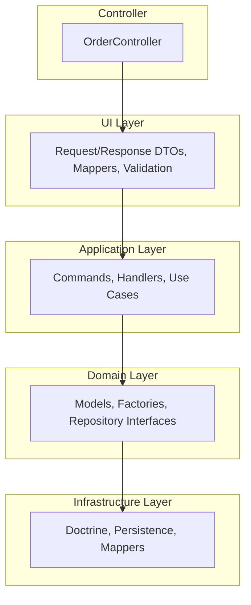

# API

Symfony-based REST API for creating orders. Tech stack: PHP/Symfony, Doctrine ORM, PostgreSQL, Docker.

## Architecture

The project follows a **layered architecture** (inspired by DDD/Hexagonal):

**Architecture layers (top-down, dependencies flow inward):**



**Layers overview:**

| Layer              | Path                  | Responsibility                                        |
| ------------------ | --------------------- | ----------------------------------------------------- |
| **Controller**     | `src/Controller/`     | HTTP routing, delegation to Application               |
| **Commands**       | `src/Command/`        | CLI commands, delegation to Application               |
| **UI**             | `src/UI/Api/`         | Request/Response DTOs, validation, exception handling |
| **Application**    | `src/Application/`    | Use cases (Commands/Handlers), transaction control   |
| **Domain**         | `src/Domain/`         | Business logic, models, repository interfaces        |
| **Infrastructure** | `src/Infrastructure/` | Doctrine entities, persistence, mappers               |

## API Endpoints

| Method | Path | Description |
|--------|------|-------------|
| **POST** | `/api/orders` | Create order. Body: `customerId`, `items` (array with `sku`, `quantity`, `price_cents`). Response: `orderId`, `orderUrl` (201 Created) |
| **GET** | `/api/orders` | List orders (paginated). Query: `page` (default 1), `perPage` (default 20, max 100). Response: `meta` (total, page, perPage, totalPages), `data` (items) |
| **GET** | `/api/orders/{id}` | Get single order by ID. Response: `orderId`, `customerId`, `totalCents`, `paid` (200). 404 if not found |

## Testing with curl

**Create order (POST):**

```bash
curl -k -X POST https://localhost:443/api/orders \
  -H "Content-Type: application/json" \
  -d '{
    "customerId": "cust-123",
    "items": [
      {"sku": "PROD-001", "quantity": 2, "price_cents": 1999},
      {"sku": "PROD-002", "quantity": 1, "price_cents": 4999}
    ]
  }'
```

**List orders (GET):**

```bash
curl -k -X GET "https://localhost:443/api/orders?page=1&perPage=20"
```

- `-k` for self-signed SSL certificates (Docker/Caddy)
- Port 443 per `compose.yaml`; use 80 for HTTP if needed

## Console Commands

**app:create-order** – Create order from CLI

- Argument: `customerId` (required)
- Option: `--item "sku:quantity:price_cents"` (repeatable)

```bash
# Local
php bin/console app:create-order cust-123 --item "sku-1:2:1999" --item "sku-2:1:499"

# Docker (service name: php)
docker compose exec php php bin/console app:create-order cust-123 --item "sku-1:2:1999" --item "sku-2:1:499"
```

## Project Structure

- `src/Controller` – HTTP controllers
- `src/Command` – Console commands (CLI entry points)
- `src/UI/Api` – Request/Response DTOs, mappers, validation
- `src/Application` – Commands, handlers, use cases
- `src/Domain` – Domain models, factories, repository interfaces
- `src/Infrastructure` – Doctrine entities, persistence, mappers

## Development Tools

Run from the project root (api directory):

| Tool | Command | Description |
|------|---------|-------------|
| **PHPUnit** | `./vendor/bin/phpunit` | Run tests |
| **PHPUnit (coverage)** | `./vendor/bin/phpunit --coverage-html .phpunit.cache/coverage/html` | Run tests with HTML coverage (requires pcov or xdebug) |
| **PHPStan** | `./vendor/bin/phpstan analyse` | Static analysis |
| **Rector** | `./vendor/bin/rector process` | Automated refactoring |
| **ECS** | `./vendor/bin/ecs check` | Code style check |
| **ECS** | `./vendor/bin/ecs fix` | Apply code style fixes |
| **Deptrac** | `./vendor/bin/deptrac analyse` | Architecture dependency analysis |
| **Schemathesis** | see below | Property-based API testing against OpenAPI schema |

### Schemathesis (API Contract Testing)

Schemathesis tests the API against its OpenAPI schema. **Voraussetzung:** Die API muss lokal laufen (z.B. via `docker compose up`).

```bash
docker run --rm --network host schemathesis/schemathesis run \
  https://localhost/api/doc.json --tls-verify=false
```

- `--network host` – Container nutzt Host-Netzwerk, damit `localhost` die laufende API erreicht
- `--tls-verify=false` – Deaktiviert TLS-Prüfung für selbstsignierte Zertifikate
- Optional: `--max-examples 20` – Weniger Testfälle pro Operation
