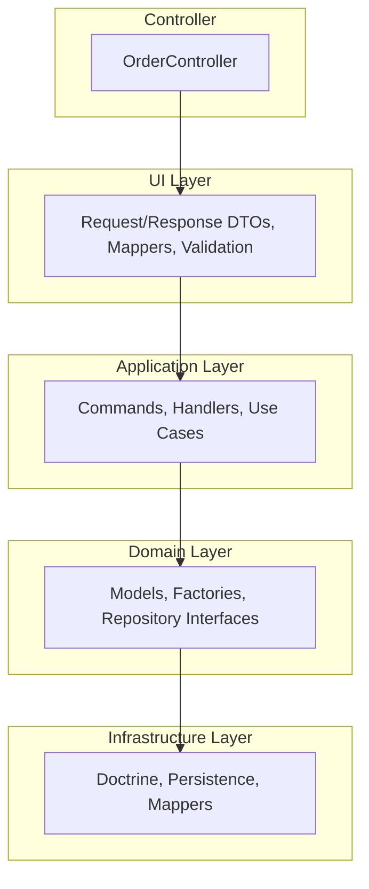
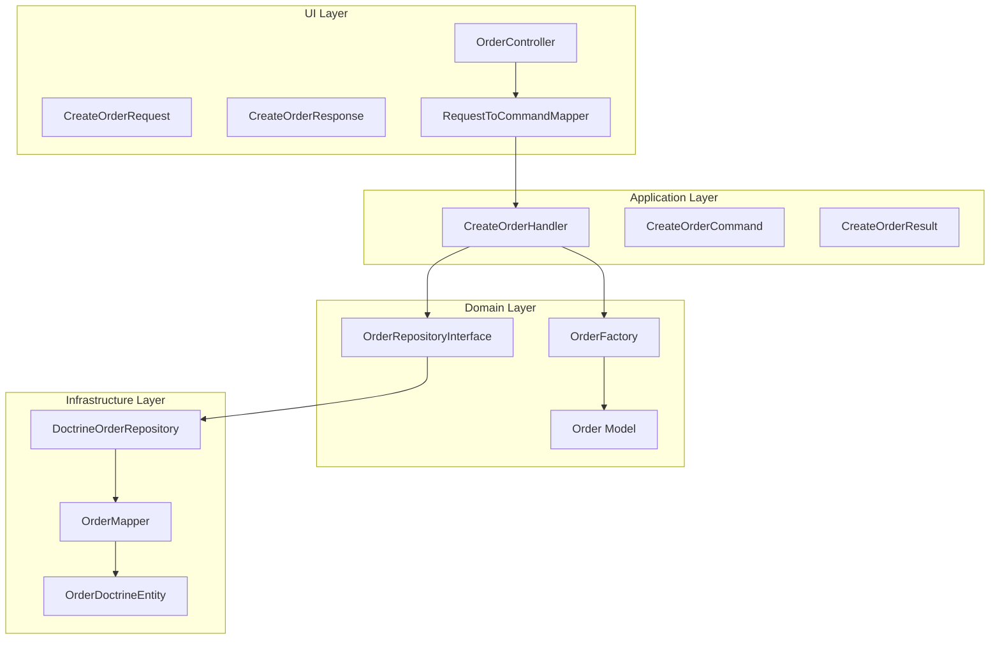

# API

Symfony-based REST API for creating orders. Tech stack: PHP/Symfony, Doctrine ORM, PostgreSQL, Docker.

## Architecture

The project follows a **layered architecture** (inspired by DDD/Hexagonal):

**Architecture layers (top-down, dependencies flow inward):**



**Request flow (Create Order):**



**Layers overview:**

| Layer              | Path                  | Responsibility                                        |
| ------------------ | --------------------- | ----------------------------------------------------- |
| **Controller**     | `src/Controller/`     | HTTP routing, delegation to Application               |
| **UI**             | `src/UI/Api/`         | Request/Response DTOs, validation, exception handling |
| **Application**    | `src/Application/`    | Use cases (Commands/Handlers), transaction control   |
| **Domain**         | `src/Domain/`         | Business logic, models, repository interfaces        |
| **Infrastructure** | `src/Infrastructure/` | Doctrine entities, persistence, mappers               |

## API Endpoint

- **POST** `/api/orders` – Create order
- Request body: `customerId`, `items` (array with `sku`, `quantity`, `price_cents`)
- Response: `orderId`, `orderUrl` (201 Created)

## Testing with curl

```bash
curl -k -X POST https://localhost:443/api/orders \
  -H "Content-Type: application/json" \
  -d '{
    "customerId": "cust-123",
    "items": [
      {"sku": "PROD-001", "quantity": 2, "price_cents": 1999},
      {"sku": "PROD-002", "quantity": 1, "price_cents": 4999}
    ]
  }'
```

- `-k` for self-signed SSL certificates (Docker/Caddy)
- Port 443 per `compose.yaml`; use 80 for HTTP if needed

## Project Structure

- `src/Controller` – HTTP controllers
- `src/UI/Api` – Request/Response DTOs, mappers, validation
- `src/Application` – Commands, handlers, use cases
- `src/Domain` – Domain models, factories, repository interfaces
- `src/Infrastructure` – Doctrine entities, persistence, mappers

## Development Tools

Run from the project root (api directory):

| Tool | Command | Description |
|------|---------|-------------|
| **PHPStan** | `./vendor/bin/phpstan analyse` | Static analysis |
| **Rector** | `./vendor/bin/rector process` | Automated refactoring |
| **ECS** | `./vendor/bin/ecs check` | Code style check |
| **ECS** | `./vendor/bin/ecs fix` | Apply code style fixes |
| **Deptrac** | `./vendor/bin/deptrac analyse` | Architecture dependency analysis |
